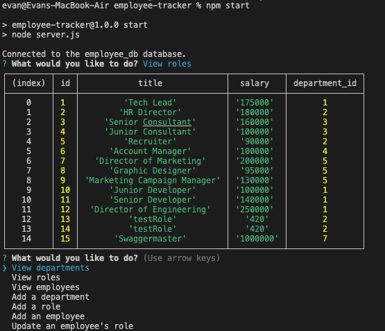

# Employee Tracker

[See this app in action!](https://drive.google.com/file/d/1S7TunmWgTb8Ziea4zGjLWCh-8QQthUEy/view)

## Table of Contents
- [Description](#description)
- [Installation](#installation)
- [Technologies](#technologies)
- [Questions](#questions)

## Description
A small utility for managing a database of employees, roles, and departments using command line prompts.

## Installation
Clone the repo, cd into the repo, run npm i to install dependencies, use mysql to run schema.sql and seeds.sql, and run 'npm start' to use the program

## Technologies
- Node.js
- Inquirer 8.2.4
- Mysql2 3.2.4

## Questions

[My GitHub Profile](https://github.com/eschindev)

[Email me!](mailto:eschindler1993@gmail.com)